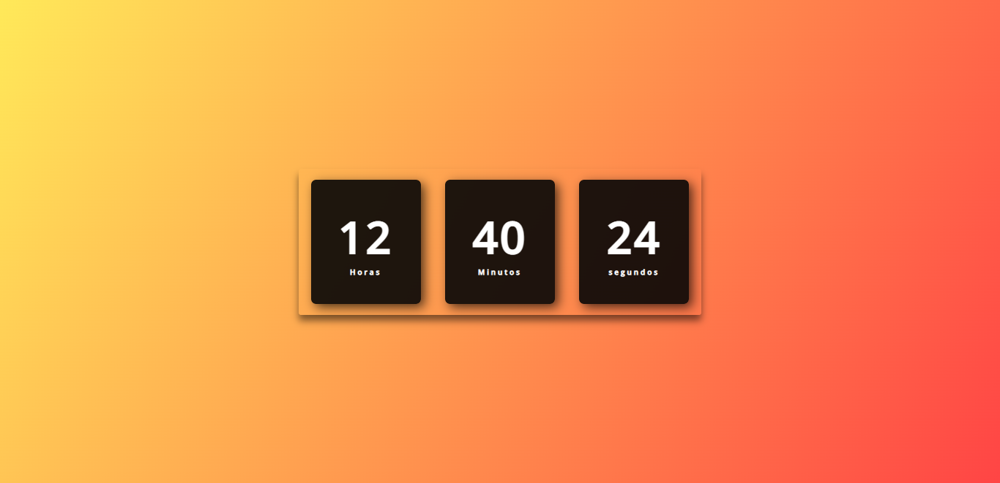

# Relógio Digital
Relógio Digital Para Praticar JavaScript

## Deploy da aplicação

https://relodig.netlify.app/

## Tecnologias utilizadas

+ HTML5
+ CSS3
+ JavaScript

## Estrutura do site

+ Horas: Mostra as Horas;
+ Minutos: Mostra os Minutos;
+ Segundos: Mostra os Segundos;

## Tela Inicial 

